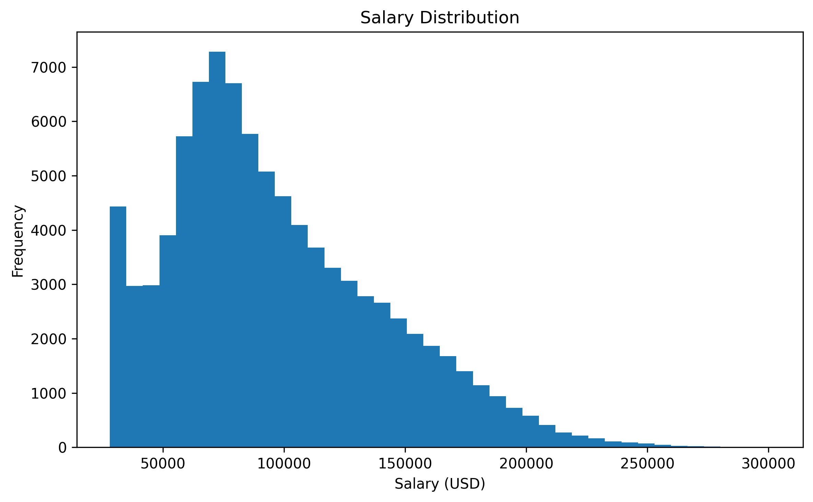
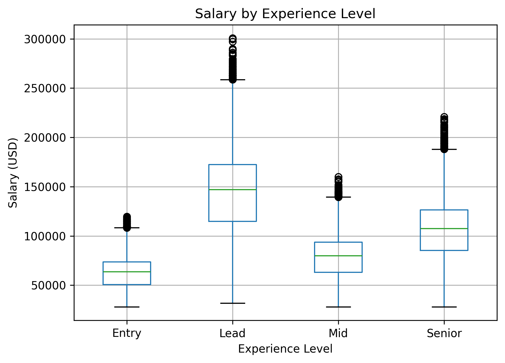
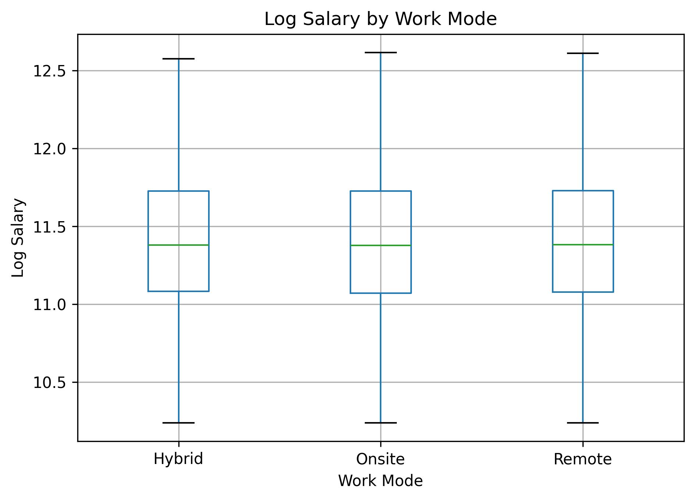
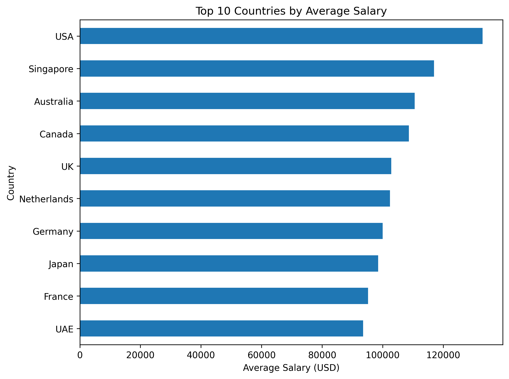
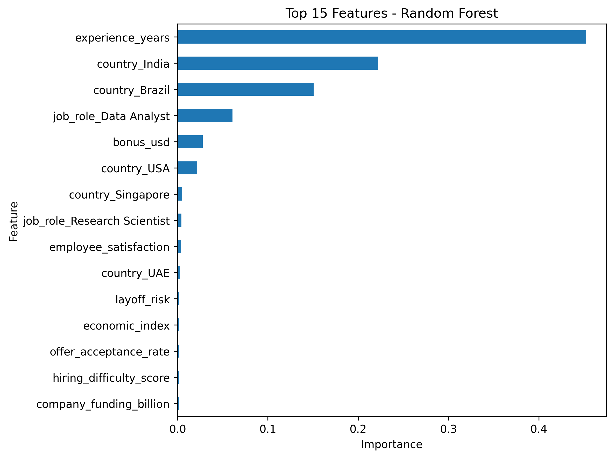
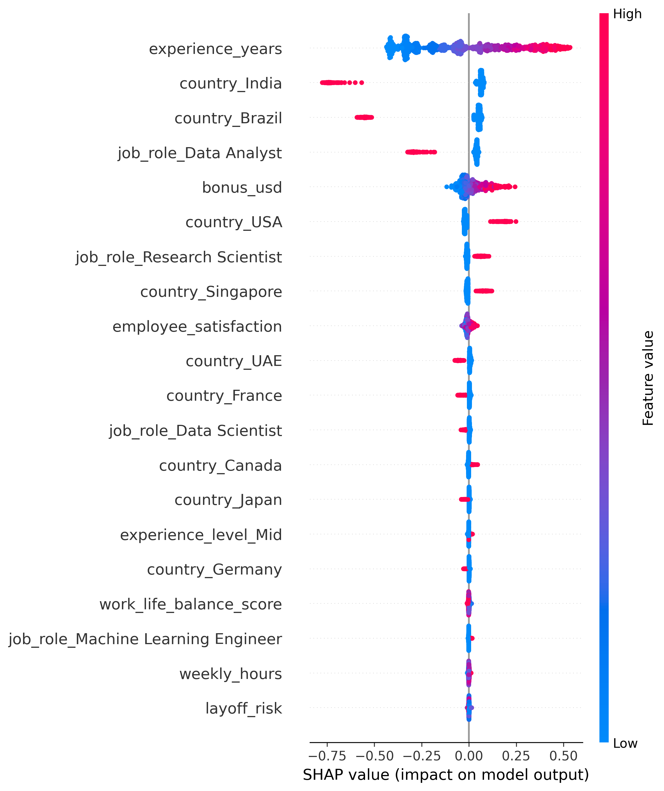

# Global AI Salary Analysis and Prediction

## 1. Introduction

This project analyzes the global AI job market to understand salary dynamics and identify the key factors that influence compensation. A particular focus is placed on evaluating whether work mode (remote, onsite, hybrid) has a measurable impact on salary.

The project combines exploratory data analysis, statistical modeling, machine learning, and model explainability.

---

## 2. Dataset

The dataset contains approximately 90,000 job records and includes:

* Job roles and AI specializations
* Experience levels and years
* Salary and bonus information
* Company characteristics
* Country-level and economic indicators

The dataset does not contain missing values, allowing direct analysis and modeling.

---

## 3. Methodology

### Data Preparation

* Salary distribution is right-skewed
* Log transformation applied to stabilize variance

### Exploratory Data Analysis

* Experience strongly correlates with salary
* Significant salary differences exist across countries
* Work mode shows minimal visible differences

### Statistical Modeling

* ANOVA test applied to compare work modes
* No statistically significant salary difference found

### Machine Learning

Models used:

* Linear Regression
* Random Forest

Evaluation metrics:

* R²
* MAE
* RMSE

### Model Interpretation

* Feature importance (Random Forest)
* SHAP analysis for interpretability

---

## 4. Results

| Model             | R²    | MAE   | RMSE  |
| ----------------- | ----- | ----- | ----- |
| Linear Regression | 0.949 | 0.090 | 0.107 |
| Random Forest     | 0.950 | 0.088 | 0.106 |

The similar performance of both models suggests that the salary structure is stable and largely linear.

---

## 5. Key Findings

* Experience is the strongest driver of salary
* Country has a significant impact on salary levels
* Job role and bonus contribute moderately
* Work mode does not have a statistically significant effect

---

## 6. Visualizations

### Salary Distribution

### Salary by Experience Level

### Log Salary by Work Mode

### Top Countries by Average Salary

### Feature Importance (Random Forest)

### SHAP Summary Plot

---

## 7. Interpretation

The results consistently show that salary differences are primarily driven by experience and geographic location. The effect of work mode becomes negligible once these factors are controlled for.

The SHAP analysis confirms that the model is interpretable and that the most important features align with statistical findings.

---

## 8. Tools and Libraries

* Python
* Pandas, NumPy
* Matplotlib
* Scikit-learn
* Statsmodels
* SHAP

---

## 9. Conclusion

This project demonstrates that compensation in the AI job market is not determined by whether a role is remote or onsite. Instead, experience and country-level factors dominate salary outcomes.

---

## Author

Berfin Su Akyürek
M.Sc. Data Science
